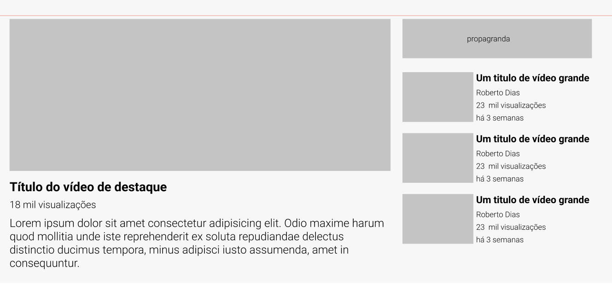

# Exercício HTML + CSS Avançado - Layout|YouTube

**Descrição da tarefa**: Esse exercício é criar um layout do YouTube para aprimorar as habilidades de posicionamento de elementos usando display grid e display flex.

Layout esperado para desktop:




## Tecnologias utilizadas
- HTML
- CSS

## Como utilizar?

1- Clone o projeto selecione a pasta aonde quer que ele fique
```
git clone url do projeto
```
2- Acesse a pasta do projeto e abra com o code (VSCode)

